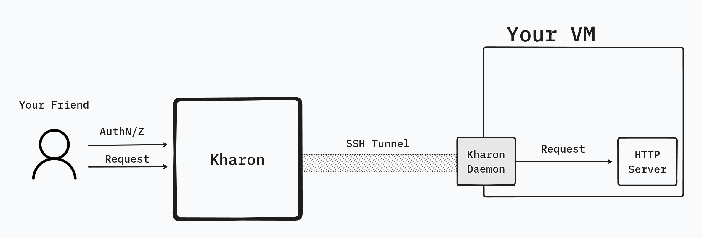

<p align="center">
   
</p>

# Shared Science

⚠️ Under Construction! ⚠️

**Reverse Proxy Server with Authentication and Authorization**

---

## Overview

This project solves the problem of sharing applications with other people around the world. This way, you can safely create dashboards with private data and share it with specific people without setting up the AuthN/Z yourself.

Shared Science is a FastAPI-based reverse proxy server with Google Authentication. It allows you to secure your applications by requiring users to authenticate via their Google accounts before accessing web servers spawned on different architectures.

<p align="center">
   
</p>

## Features

- [x] **Google Authentication:** Users must log in with their Google accounts to access protected resources.
- [ ] **Authorization:** Use [Casbin](https://dev.to/teresafds/authorization-on-fastapi-with-casbin-41og) to authorize people to access jobs.
- [x] **FastAPI:** Utilizes the FastAPI framework for efficient and fast development.
- [ ] **API Key Management:** Users can create/delete keys.
- [ ] **SharedScienceDaemon (SSD):** Small daemon that we can [tunnel](https://pypi.org/project/sshtunnel/) into with SSH.
  - [ ] Create daemon that can authenticate to the main server and link jobs.
  - [ ] **Reverse Proxy:** Directs incoming requests to the appropriate backend services.

### Key idea

The idea is that the proxy is done through an SSH tunnel, making the whole connection secure.
A user goes on the website, authenticates themselves and can see jobs linked to their account. They can then access the webpage over the tunnel.

### Recipes

- [ ] **Gradio App:** Launch your own gradio app protected behind a Google Login.
- [ ] **Azimuth:** Collaborate securely on improving your dataset or model using [Azimuth](github.com/ServiceNow/azimuth).

## Installation

1. Clone the repository:

   ```bash
   git clone https://github.com/Dref360/shared-science.git
   ```

2. Install the required dependencies:

   ```bash
   poetry install
   ```

## Configuration

1. Create a Google Cloud Platform (GCP) project and set up the OAuth 2.0 credentials.

2. Create a copy of `.env.default` named `.env` with your GCP credentials and other configuration settings.
   1. Do the same in `webapp/.env`

## Usage

1. Start the FastAPI server:

   ```bash
   poetry run fastapi dev shared_science/app.py
   ```

2. Start the frontend

   ```bash
   cd webapp && npm install
   npm start
   ```

3. Access the reverse proxy at `http://localhost:8000` and follow the Google Authentication flow.

## Contributing

Feel free to contribute to the project by opening issues or submitting pull requests. Please make sure to follow the project's code of conduct.

## License

This project is licensed under the Apache V2 License - see the [LICENSE](LICENSE) file for details.

## Acknowledgments

- FastAPI: https://fastapi.tiangolo.com/
- SQLModel: https://sqlmodel.tiangolo.com/

Thank you for using Shared Science!
