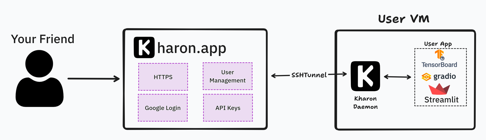

# Welcome to Kharon


This project solves the problem of sharing applications with other people around the world. This way, you can safely create dashboards with private data and share it with specific people without setting up the AuthN/Z yourself.

Kharon is a FastAPI-based reverse proxy server with Google Authentication. It allows you to secure your applications by requiring users to authenticate via their Google accounts before accessing web servers using an SSH tunnel.

<p align="center">
   
</p>

### Getting Started

1. Login at [https://kharon.app](https://kharon.app)
2. Create an API Key in the `Settings` tab.
    1. Keep it close! Kharon doesn't remember the key
3. Log into your VM

    !!! note

        Your VM **must** have the following requirements:

        1. An External IP (static or not)
        2. Port 2222 must be open
        3. Your HTTP app must be on port 8080
        4. Docker must be installed

    Run the following command to start the Kharon Daemon.
    ```bash
    export KHARON_API_KEY= ... # Your api key
    curl -O https://raw.githubusercontent.com/Dref360/kharon/main/service/docker-compose.yml && docker-compose up -d
    ```

4. Your Cluster will now show on the [Dashboard](https://kharon.app/dashboard)
    1. You can now allow users to access your cluster and access it yourself.

### Features

* ✅ **Google Authentication:** Users must log in with their Google accounts to access protected resources.
* ✅ **Authorization:** Authorize people to access jobs (using [Casbin](https://dev.to/teresafds/authorization-on-fastapi-with-casbin-41og) would be a great future implementation for fine-grained AuthZ).
* ✅ **FastAPI:** Utilizes the FastAPI framework for efficient and fast development.
* ✅ **API Key Management:** Users can create/delete keys.
* ✅ **KharonDaemon (KHD):** Small daemon that we can [tunnel](https://pypi.org/project/sshtunnel/) into with SSH.
    * ✅ **SSH Server**
    * ✅ **Automatic registration to host**
    * ✅ **Reverse Proxy:** Directs incoming requests to the appropriate backend services.


!!! warning

    I know the app isn't super fast. It's due to a bunch of factor that I will improve over time. For example, we create a new tunnel for every request and the backend runs on a small Cloud Run.

    If there is some demand for this product, I will improve it :)


